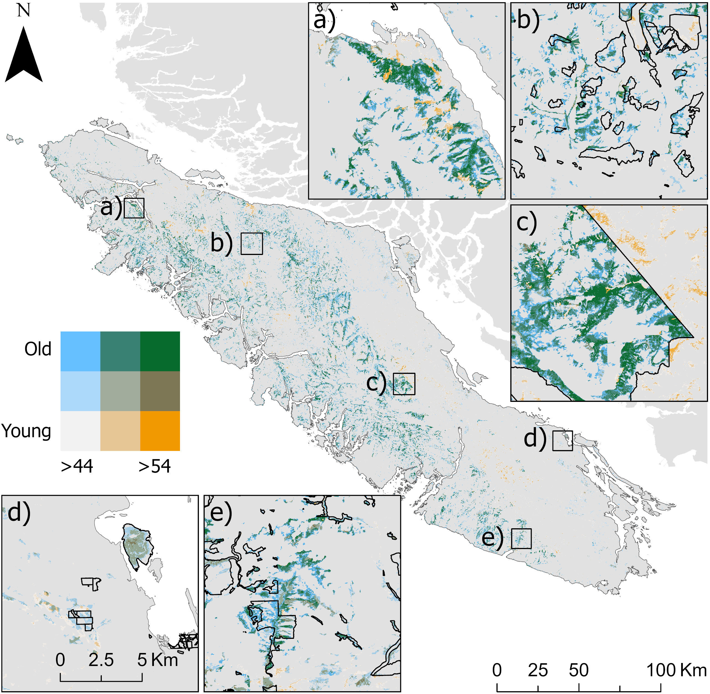

# The Last Giants: Deep Learning Reveals Critical Conservation Gaps in Canada's Coastal Temperate Rainforests 

**Authors:**\
Luizmar de Assis Barrosa, José Bermúdezb, Karen Pricec, Camile Sothed, Chris Johnsona, Juan Pablo Ramírez-Delgadoa, Xavier Llanoa, Alemu Gonsamob, Michelle Ventera, Oscar Ventera

a *University of Northern British Columbia, 3333 University Way, Prince George, V2N 4Z9, British Columbia, Canada*\
b *McMaster University, Hamilton, L8S 4K1, Canada
c *Independent Researcher, 1355 Malkow Road, Smithers, BC V0J 2N7, Canada*\
d *Planet Labs PBC, San Francisco, 695571, California, USA*

---

## Abstract

Canada’s coastal temperate rainforests support some of the world’s largest trees. Yet, decades of logging concentrated in the most productive forests, combined with the protection of less-productive areas, have transformed much of this ecosystem into younger, homogeneous stands. Such biases, compounded by natural mortality and slow recruitment, place big trees among the most imperiled organisms on Earth. Effective conservation efforts must address these historical biases by protecting rare big-treed forests. Current inventories lack spatial resolution, accuracy, and ability to capture forests sustaining the largest trees. To overcome these limitations, we developed a high-resolution (10-m) big-treed forest map by integrating airborne LiDAR, satellite imagery, and a deep learning approach. We identified approximately 160,000 hectares of big-treed forests, with roughly half located in human-modified landscapes and half in regions with reduced accessibility and limited disturbance. Of these last remaining big-treed forests, about 62% were unprotected. Notably, only 38% of the existing protected areas (PAs) and less than 2% of Other Effective Conservation Measures (OECMs) contain at least 1 ha of big-treed forest. Together, our results show that big-treed forests are under-protected, highly fragmented, and vulnerable to further human-caused loss. Our study provides a scalable, open-access framework for high-accuracy mapping and monitoring of big-treed forests to support targeted conservation of these rare and vulnerable ecosystems.

---

## Significance Statement

Big-treed forests are among the most ecologically valuable yet most threatened components of coastal temperate rainforests. Their conservation has been hindered by the absence of accurate, high-resolution maps capable of identifying where the largest trees persist. We address this gap by developing a 10-m big-treed forest map using airborne LiDAR, satellite imagery, and deep learning, revealing their true extent, distribution, and protection status. Our results show that these forests are rare, highly fragmented, and disproportionately unprotected, with about half occurring in remote, reduced-access regions and half in human-modified landscapes. Although focused on Vancouver Island, Canada, our approach provides a scalable, open-access framework to guide conservation planning and long-term monitoring of threatened big-treed ecosystems worldwide.

---

## Keywords
Keystones, LiDAR, Old-growth forests, Multispectral Imagery, SAR imagery.

---

## Main Result

**Figure 1** Bivariate map of big tree forests locations, classified into top 10% (> 44m), top 5% (>=48m) and 1% (>=54m) tallest canopies and old (>=250 years); mature (>80 and <250 years); and young/second growth forest (<80years) on the Islands on Vancouver Island: a) large unprotected old big-tree forests northwest of the island; b) old-growth management areas (OGMAs), a type of OECM, north of the Woss village in the Nimpkish Valley; c) southeast Strathcona park boundary; d) Coastal Douglas fir mature big-tree forest inside the Saysutshun (Newcastle Island Marine) Park; and e) Fairy Creek watershed partially covered by OGMAs. 

# R Scripts Description:
**- 1_BC_tree_data.R**\
  Pre-processing of British Columbia tree-level field inventory data and calculation of old-growth structural attributes\
**- 2_plot_level_comp_metrics.R**\
  Calculation of LiDAR-derived Forest Structural Complexity (FSC) indices at plot level\
**- 3_comp_met_analysis.R**\
  Random forest analysis of field-measured old-growth structures vs LiDAR FSC indices\
**- 4_Anova_analysis_Full.R**\
  Comparison of stand age groups, Maturity clusters, and Productivity vs FSC

# Data Summaries:
**data_Full.csv**: Field and LiDAR metrics unfiltered\
**data_75.csv**: Field and LiDAR metrics filtered with a voxel size of 0.4 m, resulting in a drop of 25% on the point cloud density\
**data_50.csv**: Field and LiDAR metrics filtered with a voxel size of 0.75 m, resulting in a drop of 50% on the point cloud density
