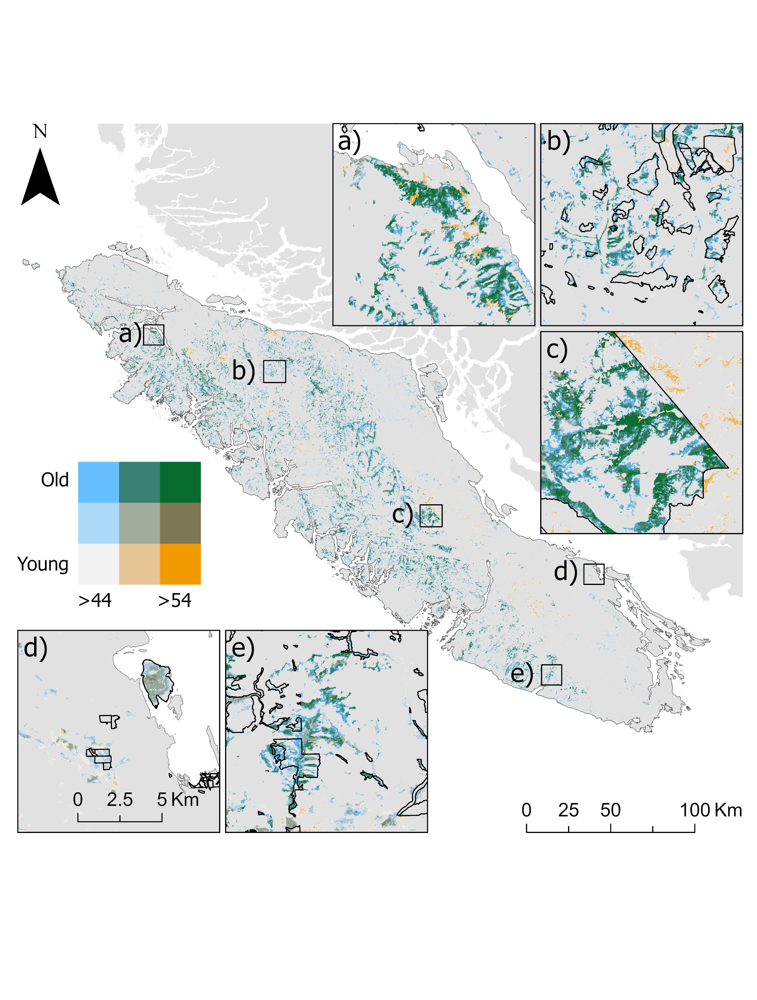

# THE LAST GIANTS: MAPPING BIG-TREE FORESTS OF VANCOUVER ISLAND WITH DEEP LEARNING AND LIDAR-SENTINEL FUSION  

**Authors:**\
Luizmar de Assis Barrosa, Karen Priceb, Camile Sothec, Chris Johnsona, Juan Pablo Ramírez-Delgadoa, Xavier Llanoa, Michelle Ventera, Oscar Ventera

a *University of Northern British Columbia, 3333 University Way, Prince George, V2N 4Z9, British Columbia, Canada*\
b *Independent Researcher, 1355 Malkow Road, Smithers, BC V0J 2N7, Canada*\
c *Planet Labs PBC, San Francisco, 695571, California, USA*

---

## Abstract

Temperate rainforests of the Pacific Northwest of Canada are home to some of the largest trees in the World. Decades of overharvesting, targeting the most productive forests, and biased protection of low-productivity and low-accessibility forests have transformed much of the complex, large-treed old-growth into young, homogeneous stands. Adding to big-trees’ natural mortality and slow recruitment, such biases put these trees among the most imperilled organisms on earth. In the context of the 30x30 goals, it is crucial that conservation efforts first aim to alleviate these historical biases by targeting these rare large-treed forests. Current mapping of the remaining large-treed forests is insufficient to support conservation efforts. To address this gap, we developed a high-resolution canopy height model using a UNET deep-learning approach, trained on LiDAR-derived 99th percentile heights and various combinations of predictor variables derived from Sentinel-1 and -2. Compared to global canopy height models, our model trained with Sentinel-1 and Sentinel-2 (R² = 0.76, MAE = 4.90 m, RMSE = 6.92, BIAS = 0.34 m) improved explained variance by 35%, reduction in prediction error 27% for RMSE and 33% for MAE, reduced bias by ~10x, and increased the maximum predicted height from 58 m to 81 m. We identified 160k ha (31k – 314k ha) of big tree forests, with big-trees defined as the Top 5% = 48 m [Top 1% = 54 m to Top 10% = 44 m]. We also found that the majority of these forests are in high elevations (500 to 800 m), on steep slopes (24–40°), and within 100 m of streams or wet areas, which are less accessible to humans and machinery or have legal restrictions. As for their protection status, 62% of big-tree forests are currently unprotected, 27% within formally protected areas, and 11% in OECMs. When overlapped with harvested areas, we found that 3k ha, equivalent to more than 4,000 soccer fields of logged big tree forests between 2019 and 2025. Part of these logging operations occurred within old-growth management areas, a type of OECM. Our work offers a framework for conservation and monitoring of big tree forests with high accuracy and open-source data, enabling targeted conservation efforts that can mitigate historical forestry and conservation biases.

---

## Index Terms
Keystones, Deep Learning, Old-growth forests, Multispectral Imagery, SAR imagery

---

## Main Result

**Figure 1** Scatter plot of FSC vs a) log transformed stand age and b) forest maturity index (IMAT). 

# R Scripts Description:
**- 1_BC_tree_data.R**\
  Pre-processing of British Columbia tree-level field inventory data and calculation of old-growth structural attributes\
**- 2_plot_level_comp_metrics.R**\
  Calculation of LiDAR-derived Forest Structural Complexity (FSC) indices at plot level\
**- 3_comp_met_analysis.R**\
  Random forest analysis of field-measured old-growth structures vs LiDAR FSC indices\
**- 4_Anova_analysis_Full.R**\
  Comparison of stand age groups, Maturity clusters, and Productivity vs FSC

# Data Summaries:
**data_Full.csv**: Field and LiDAR metrics unfiltered\
**data_75.csv**: Field and LiDAR metrics filtered with a voxel size of 0.4 m, resulting in a drop of 25% on the point cloud density\
**data_50.csv**: Field and LiDAR metrics filtered with a voxel size of 0.75 m, resulting in a drop of 50% on the point cloud density
