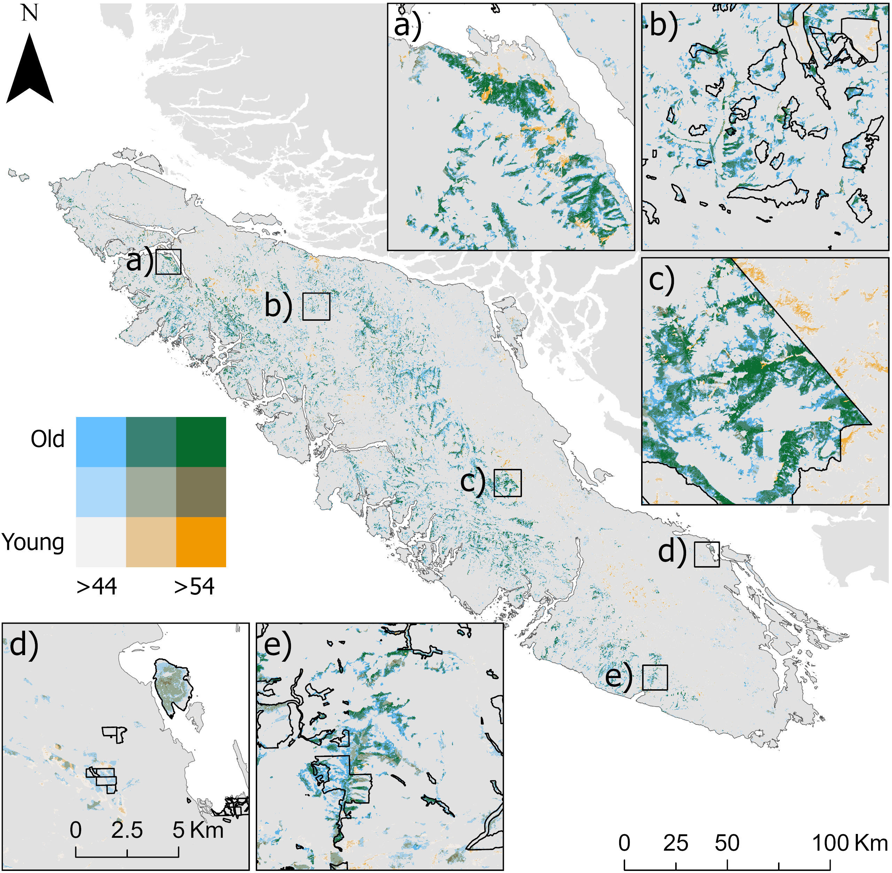

# Deep learning Reveals Large Trees as a Critical Conservation Gap in Canada's Coastal Temperate Rainforests 

**Authors:**\
Luizmar de Assis Barrosa, Karen Priceb, Chris Johnsona, José Bermúdezc, Juan Pablo Ramírez-Delgadoa, Xavier Llanoa, Camile Sothed, Alemu Gonsamob, Michelle Ventera, Oscar Ventera

a *University of Northern British Columbia, 3333 University Way, Prince George, V2N 4Z9, British Columbia, Canada*\
b *Independent Researcher, Salt Spring Island, V8K 1Y8, Canada*\
c *School of Earth, Environment & Society, McMaster University, Hamilton, L8S 4K1, Canada*\
d *Planet Labs PBC, San Francisco, 695571, California, USA*

---

## Abstract

Canada’s coastal temperate rainforests support some of the world’s largest trees. Yet, decades of logging concentrated in the most productive forests, combined with the protection of less-productive areas, have transformed much of this ecosystem into younger, homogeneous stands. Such land use and conservation biases, compounded by natural mortality and slow recruitment, place large trees among the most imperiled organisms on Earth. Effective conservation efforts must address these historical biases by protecting rare large-tree forests. Current inventories, while valuable, lack spatial resolution, accuracy, and the ability to capture forests sustaining the largest trees. To overcome these limitations, we developed a scalable, open-access framework integrating airborne LiDAR and Sentinel-1 and -2 imagery to identify, monitor, and support management of the remaining large-tree forests. We demonstrated this framework for Vancouver Island, BC, home to some of the world’s largest trees. Across ~2.7 million ha of forests, we identified approximately 133,000 hectares of large-tree forests. Roughly half were directly exposed to human pressures, while the remainder occurred in less accessible, lower disturbance areas. Of these last remaining large-tree forests, 73% were outside formal protected areas (PAs). Notably, the protected portion of these forests was highly fragmented, with fewer than one-quarter of PAs containing more than 1 ha of large-tree forests. Together, these results show that large-trees under-protected, highly fragmented, and vulnerable to further human-caused loss. Our study provided a transferable approach to support targeted conservation and monitoring of these rare and vulnerable ecosystems.

---

## Keywords
Airborne LiDAR, Forest conservation, GeoAI, Old-growth forests, Synthetic aperture radar.

---

## Main Result

**Figure 1** Bivariate map of big tree forests locations, classified into top 10% (> 44m), top 5% (>=48m) and 1% (>=54m) tallest canopies and old (>=250 years); mature (>80 and <250 years); and young/second growth forest (<80years) on the Islands on Vancouver Island: a) large unprotected old big-tree forests northwest of the island; b) old-growth management areas (OGMAs), a type of OECM, north of the Woss village in the Nimpkish Valley; c) southeast Strathcona park boundary; d) Coastal Douglas fir mature big-tree forest inside the Saysutshun (Newcastle Island Marine) Park; and e) Fairy Creek watershed partially covered by OGMAs. 

# Python Scripts Description:
**- 1_Prep_IMG_MSK.ipynb**\
  Download and pre-processing of the wall-to-wall data predictors, as well as alignment all predictors and reference data tiles\
**- 2_Patchify_IGM_MSK.ipynb**\
  Sample acquisition of coregistered patches (128x128 pixels, 10m resolution) of the reference and predictors data\
**- 3_DL_training.py**\
  Deep learning model training using training and validation patches obtained from step 2\
**- 4_Deep_learning_UNET.py**\
  Two U-Net architectures used during our ablation study. While both structures are nearly identical, the second includes a second output channel for uncertainty estimation\
**- 5_loss_Wloss.py**\
Loss functions used for model training and assessment\
**- 6_utils.py**\
Functions used for reading and processing image patches, obtained from <https://github.com/Vooban>\
**- 7_Predict_height.py**\
Once the model was calibrated and the best five epochs selected, we predicted canopy height and cover using our wall-to-wall predictors. We loaded each of the best five epochs, predicted, and combined the results.\
**- 8_smooth_tile_predition.py**\
Predictions results often degraded towards the edges of patches. This function helps minimize this effect for a seamless merging of all predicted patches. Obtained from <https://github.com/Vooban>\
**- 9_Crop&merge_predition.ipynb**\
To further improve prediction on edges, our prediction was performed for tiles with 250-pixel buffers. Here, we removed the buffer and merged the results.

# R Scripts Description:
**- 1_Big_treed_Forest_Maps.R**\
  Here we mapped big-treed forest using our locally trained canopy cover  and height layers, as well as an alternative global dataset and a local map of forest inventory commonly used in local studies\
**- 2_Fig1_FigS1_S2_S6_S8.R**\
  Data processing leading to Figure 1 and Supplemental Figures 1, 2, 6 and 8. Here we obtain ~1.1 million reference LiDAr pixels and use to assess models' performance and residuals\
**- 3_FigS3_Tables.R**\
  Processing of all big-treed forest maps leading to Figure S3 and main and supplemental result tables. Here we assessed big-treed forest overlaps across different scales and alternative dataset\
**- 4_FigureS4_S5.R**\
  Processing of big-treed forest centroids to assess big-treed forest distribution across environmental gradients. 

